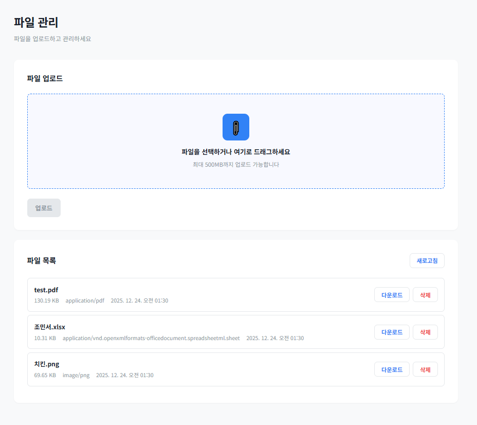

# Event-Driven Architecture Template

Hexagonal Architecture 기반의 이벤트 드리븐 파일 관리 시스템 템플릿입니다.

## 개요


이 프로젝트는 파일 업로드, 다운로드, 삭제, 목록 조회 기능을 제공하는 이벤트 드리븐 아키텍처 템플릿입니다. Transactional Outbox 패턴을 통해 이벤트 발행의 원자성을 보장하며, 포트-어댑터 패턴으로 외부 의존성을 분리합니다.

## 주요 기능
- 파일 업로드 (최대 500MB)
- 파일 다운로드
- 파일 삭제
- 파일 목록 조회
- 웹 UI 제공 (드래그 앤 드롭 지원)
- Transactional Outbox 패턴으로 이벤트 유실 방지
- 원자적 트랜잭션 보장 (파일 저장 + 메타데이터 + 이벤트)

## 아키텍처

### Hexagonal Architecture

```
                    ┌─────────────────────────────────┐
                    │      API Layer (REST)          │
                    │   FileController               │
                    └────────────┬──────────────────┘
                                 │
                    ┌────────────▼──────────────────┐
                    │   Application Layer           │
                    │  ┌──────────────────────────┐ │
                    │  │  FileUploadUseCase       │ │
                    │  │  FileDownloadUseCase     │ │
                    │  │  FileDeleteUseCase       │ │
                    │  │  FileListUseCase         │ │
                    │  └──────────────────────────┘ │
                    └────────────┬──────────────────┘
                                 │
        ┌────────────────────────┼────────────────────────┐
        │                        │                        │
┌───────▼────────┐      ┌───────▼────────┐      ┌───────▼────────┐
│  Domain Layer  │      │  Domain Layer  │      │  Domain Layer  │
│                │      │                │      │                │
│ FileRecord     │      │    Ports       │      │  Business      │
│ (Entity)       │      │  (Interfaces)  │      │  Logic         │
│                │      │                │      │                │
│ • StoragePort  │      │ • Repository   │      │ • Rules        │
│ • EventPort    │      │ • Publisher    │      │ • Validation   │
└───────┬────────┘      └───────┬────────┘      └───────┬────────┘
        │                        │                        │
        └────────────────────────┼────────────────────────┘
                                 │
                    ┌────────────▼──────────────────┐
                    │   Infrastructure Layer        │
                    │   (Adapters)                  │
                    │                               │
        ┌───────────┼───────────┐                   │
        │           │           │                   │
┌───────▼────┐ ┌───▼────┐ ┌───▼────────┐  ┌───────▼────┐
│ SeaweedFS  │ │  JPA   │ │  Outbox    │  │   Kafka    │
│ Adapter    │ │Adapter │ │  Adapter   │  │  Producer  │
└───────┬────┘ └───┬────┘ └───┬────────┘  └───────┬────┘
        │          │           │                   │
        └──────────┼───────────┼───────────────────┘
                   │           │
        ┌──────────▼───────────▼───────────┐
        │    External Systems              │
        │                                  │
        │  SeaweedFS  PostgreSQL  Kafka    │
        └──────────────────────────────────┘
```

### 데이터 흐름 (파일 업로드)

```
1. Client (Browser/API)
   │
   ├─ POST /api/files/upload
   │
   ▼
2. FileController
   │
   ├─ FileUploadUseCase.execute()
   │
   ├─▶ StoragePort.upload() ──────────┐
   │                                    │
   ├─▶ Repository.save() ──────────────┤
   │                                    │
   └─▶ EventPublisher.publish() ───────┤
                                        │
                        ┌───────────────┴───────────────┐
                        │   @Transactional              │
                        │   (Atomic Operation)          │
                        └───────────────┬───────────────┘
                                        │
                        ┌───────────────▼───────────────┐
                        │  1. File → SeaweedFS          │
                        │  2. Metadata → PostgreSQL     │
                        │  3. Event → Outbox Table      │
                        └───────────────┬───────────────┘
                                        │
                        ┌───────────────▼───────────────┐
                        │   OutboxRelay (Scheduler)     │
                        │   polls outbox_events         │
                        └───────────────┬───────────────┘
                                        │
                        ┌───────────────▼───────────────┐
                        │   Kafka Producer              │
                        │   Topic: file-uploaded        │
                        └───────────────────────────────┘
```

### 핵심 설계 패턴

**1. Hexagonal Architecture (포트 & 어댑터)**
- Domain Layer: 비즈니스 로직과 포트 인터페이스
- Application Layer: 유즈케이스 조율
- Infrastructure Layer: 외부 시스템 어댑터

**2. Transactional Outbox Pattern**
- DB 트랜잭션과 이벤트 발행의 원자성 보장
- Outbox 테이블에 이벤트 저장 후 별도 스레드가 폴링하여 Kafka 발행
- 이벤트 유실 방지

**3. Port & Adapter Pattern**
- StoragePort: 스토리지 추상화 (SeaweedFS 어댑터로 구현)
- FileRecordRepositoryPort: 저장소 추상화 (JPA 어댑터로 구현)
- EventPublisherPort: 이벤트 발행 추상화 (Outbox 어댑터로 구현)

## 프로젝트 구조

```
src/main/java/com/minseojo/template/
│
├── api/                              # API Layer (Inbound Adapter)
│   └── FileController.java           # REST 엔드포인트
│
├── application/                      # Application Layer
│   └── file/
│       ├── FileUploadUseCase.java    # 업로드 유즈케이스
│       ├── FileDownloadUseCase.java  # 다운로드 유즈케이스
│       ├── FileDeleteUseCase.java    # 삭제 유즈케이스
│       └── FileListUseCase.java      # 목록 조회 유즈케이스
│
├── domain/                           # Domain Layer (핵심)
│   └── file/
│       ├── FileRecord.java           # 도메인 엔티티
│       └── port/                     # 포트 인터페이스
│           ├── FileRecordRepositoryPort.java
│           ├── StoragePort.java      # 스토리지 포트
│           └── EventPublisherPort.java
│
└── infrastructure/                   # Infrastructure Layer
    ├── adapter/                      # 어댑터 구현
    │   ├── storage/
    │   │   └── SeaweedFsStorageAdapter.java
    │   └── event/
    │       └── OutboxEventPublisherAdapter.java
    │
    ├── persistence/                  # JPA 어댑터
    │   ├── FileRecordJpaRepositoryAdapter.java
    │   └── jpa/
    │       ├── FileRecordJpaEntity.java
    │       └── FileRecordJpaRepository.java
    │
    ├── outbox/                       # Outbox 패턴
    │   ├── OutboxEvent.java
    │   ├── OutboxRepository.java
    │   └── OutboxRelay.java         # Outbox 폴링 & 릴레이
    │
    └── config/
        └── CorsConfig.java          # CORS 설정
```

## 실행 방법

### 1. 인프라 실행

```bash
docker-compose up -d
```

실행되는 서비스:
- PostgreSQL (포트: 5432)
- SeaweedFS Master (포트: 9333)
- SeaweedFS Volume (포트: 18080)
- SeaweedFS Filer (포트: 8888)
- Kafka (포트: 9092)

### 2. 애플리케이션 실행

```bash
# Windows
.\gradlew.bat bootRun

# Linux/Mac
./gradlew bootRun
```

또는 빌드 후 실행:
```bash
./gradlew build
java -jar build/libs/event-driven-architecture-template-1.0.0-TEMPLATE.jar
```

### 3. 웹 UI 접속

```
http://localhost:8080
```

파일 업로드/다운로드/삭제가 가능한 웹 UI가 제공됩니다.

**웹 UI 미리보기:**


## API 명세

### 파일 업로드

**요청**
```
POST /api/files/upload
Content-Type: multipart/form-data

Form Data:
  file: <file>
```

**응답**
```json
{
  "fileId": 1,
  "message": "File uploaded successfully"
}
```

### 파일 목록 조회

**요청**
```
GET /api/files
```

**응답**
```json
[
  {
    "id": 1,
    "originalFilename": "example.pdf",
    "storageKey": "/files/uuid/example.pdf",
    "contentType": "application/pdf",
    "sizeBytes": 1024,
    "uploadedAt": "2024-12-24T10:00:00"
  }
]
```

### 파일 다운로드

**요청**
```
GET /api/files/{id}/download
```

**응답**
- Content-Type: 파일의 MIME 타입
- Content-Disposition: attachment; filename="..."
- Body: 파일 바이너리 데이터

### 파일 삭제

**요청**
```
DELETE /api/files/{id}
```

**응답**
```json
{
  "message": "File deleted successfully"
}
```

## 기술 스택

| 기술 | 버전 | 용도 |
|------|------|------|
| Java | 17 | 프로그래밍 언어 |
| Spring Boot | 3.2.0 | 프레임워크 |
| PostgreSQL | 15 | 관계형 데이터베이스 |
| SeaweedFS | latest | 객체 스토리지 |
| Kafka | 3.7.0 | 메시지 브로커 |
| Gradle | - | 빌드 도구 |
| Docker Compose | - | 인프라 오케스트레이션 |

## 주요 특징

### 원자적 트랜잭션

파일 업로드 시 다음이 하나의 트랜잭션으로 처리됩니다:
1. SeaweedFS에 파일 저장
2. PostgreSQL에 메타데이터 저장
3. Outbox 테이블에 이벤트 저장

### 이벤트 드리븐

- 파일 업로드 완료 시 FILE_UPLOADED 이벤트 발행
- Kafka 토픽으로 이벤트 전달
- 다른 서비스에서 이벤트 구독 가능

### 확장 가능한 아키텍처

- 포트 인터페이스로 외부 의존성 분리
- 스토리지를 S3, Azure Blob 등으로 교체 가능
- 저장소를 MongoDB 등으로 교체 가능

## 설정

### application.yml

```yaml
spring:
  servlet:
    multipart:
      max-file-size: 500MB      # 최대 파일 크기
      max-request-size: 500MB

seaweedfs:
  filer:
    url: http://localhost:8888  # SeaweedFS Filer URL
    base-path: /files           # 파일 저장 경로
```

### docker-compose.yml

PostgreSQL, SeaweedFS, Kafka 서비스 정의 및 네트워크, 볼륨 설정 포함.

## 테스트

```bash
# 파일 업로드
curl -X POST http://localhost:8080/api/files/upload \
  -F "file=@test.pdf"

# 파일 목록 조회
curl http://localhost:8080/api/files

# 파일 다운로드
curl -O http://localhost:8080/api/files/1/download

# 파일 삭제
curl -X DELETE http://localhost:8080/api/files/1
```

## 참고 자료

- [Hexagonal Architecture](https://alistair.cockburn.us/hexagonal-architecture/)
- [Transactional Outbox Pattern](https://microservices.io/patterns/data/transactional-outbox.html)
- [SeaweedFS Documentation](https://github.com/seaweedfs/seaweedfs)
